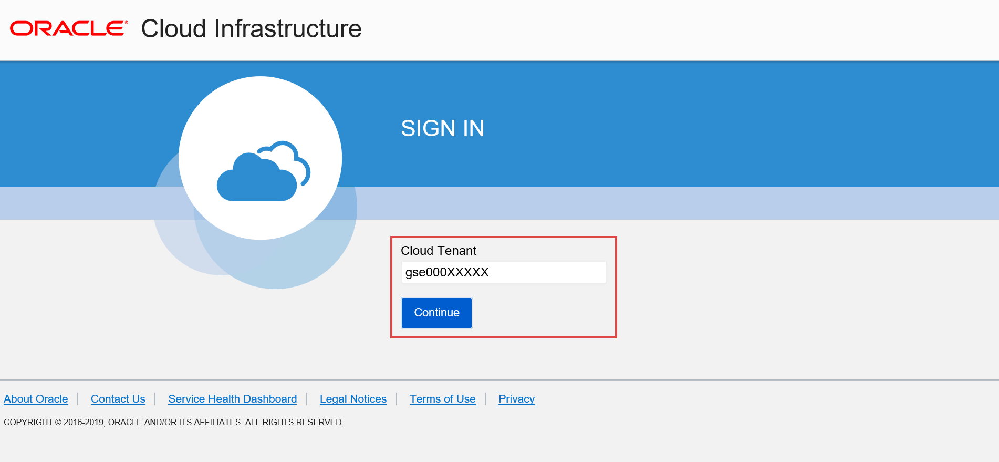
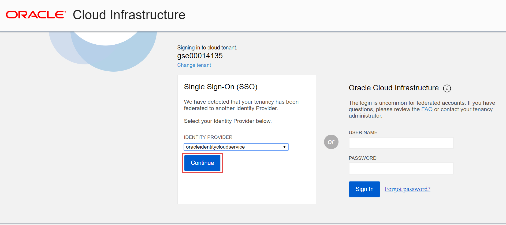
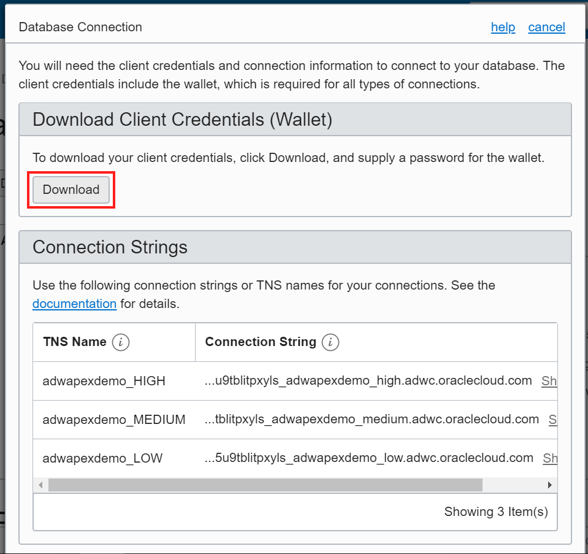

# Lab 100

## Introduction

This lab will show you how to setup the Autonomous Data Warehouse

## Objectives

- Get comfortable with Oracle's public cloud services

- ADWCS Provisioning

- ADWC Connectivity

## Notional Architecture and Trial Account access

### **STEP 1**: Review Notional Architecture

#### What is an Autonomous Data Warehouse?

Oracle Autonomous Data Warehouse is built around the market leading Oracle database and comes with fully automated data warehouse specific features that deliver outstanding query performance.  This environment is delivered as a fully managed cloud service running on optimized high-end Oracle hardware systems.  You don’t need to spend time thinking about how you should store your data, when or how to back it up or how to tune your queries.  

We take care of everything for you.

Click here to <a href="https://www.youtube.com/watch?v=tZMZODoi2xw" target="blank">watch our short video</a> that explains the key features in Oracle's Autonomous Data Warehouse.

Oracle’s Autonomous Data Warehouse is the perfect quick-start service for fast data loading and sophisticated data reporting and analysis.  Oracle manages everything for you so you can focus on your data.

Read on to begin your Getting Started journey with Oracle Autonomous Data Warehouse.

### **STEP 2**: Lab Prerequisites – Required Software
- Oracle Cloud Account
- Sql Developer

<a href="https://cloudcustomerconnect.oracle.com/resources/32a53f8587/summary" target="blank">**Cloud Customer Connect**</a> Forum for Autonomous Data Warehouse
If you have a question during this workshop then use the Autonomous Data Warehouse Forum to post questions, connect with experts, and share your thoughts and ideas about Oracle Autonomous Data Warehouse.

Are you are completely new to the <a href="https://cloudcustomerconnect.oracle.com/resources/32a53f8587/summary" target="blank">**Cloud Customer Connect**</a> forums? Visit our  <a href="https://cloudcustomerconnect.oracle.com/pages/1f00b02b84" target="blank">Getting Started forum page</a> to learn how to best leverage community resources.

### **STEP 3**: Access the Cloud

- Navigate to https://console.us-ashburn-1.oraclecloud.com
Note : Change region name(us-ashburn-1) in above URl

- Enter your tenancy name and click continue.

   

- Click continue to go in login page and then enter username/password

   

   

- Click top left menu to see all available service.

   

## ADWCS and DBaaS Provisioning

### **STEP 4**: ADWCS Provisioning

- Login to cloud environment,Click on the Menu Icon to show the available services. In the list of available services, select Autonomous Data Warehouse.

- The console for Autonomous Data Warehouse displays. You can use the List Scope drop-down menu to select a compartment; in this example the gse000#### (root) compartment is selected. Click Create Autonomous Data Warehouse.

  

- In the Create Autonomous Data Warehouse dialog, enter the following information.
  * Display Name - Enter a name for the data warehouse for display   (eg. adwapexdemo).
  * Database Name - Use letters and numbers only, starting with a letter (eg. adwapexdemo). Maximum length is 14 characters. (Underscores not initially supported.)
  * CPU Core Count - Number of CPUs for your service.(Minimum to be 5)
  * Storage (TB) - Select your storage capacity in terabytes. It is the actual space available to your service instance, including system-related space allocations.(Minimum to be 1 TB)
  * Administrator Credentials - Password (BEstrO0ng_#11) for ADMIN user of the service instance. The password must meet the following requirements:
  * The password must be between 12 and 30 characters long and must include at least one uppercase letter, one lowercase letter, and one numeric character.
      * The password cannot contain the username.
      * The password cannot contain the double quote (") character.
      * The password must be different from the last 4 passwords used.
      * The password must not be the same password that is set less than 24 hours ago.
  * License Type - Select whether you have existing licenses or if you want to subscribe to new database software licenses and the database cloud service.
  * Tags - (Optional) Tagging is a metadata system that allows you to organize and track resources within your tenancy. Tags are composed of keys and values which can be attached to resources.
  * Click Create Autonomous Data Warehouse.
  
  
- The Create Autonomous Data Warehouse dialog closes. On the console, the State field indicates that the data warehouse is Provisioning. Once creation is completed, the State field changes from Provisioning to Available.
 
 
- Download the Credentials Zip File. Once you have created the data warehouse, download the credentials zip file for client access to that data warehouse. Click newly created instance and then select DB Connection.
- The Database Connection dialog opens for downloading client credentials. Click Download.
 
- In the Download Wallet dialog, enter an encryption password (BEstrO0ng_#11) for the wallet, confirm the password, and then click Download.
 
- Click Save File, and then click OK.
- Store the zip file and make note of the password. You will use the zip file in the next step to define a SQL Developer connection to your Autonomous Data Warehouse database.
-	Open SQL Developer on your local computer. In the Connections panel, right-click Connections and select New Connection.
 
- The New/Select Database Connection dialog appears. Enter the following information.
  * Connection Name - Enter the name for this cloud connection.
  * Username - Enter the database username. Use the default administrator database account (admin) that is provided as part of the service.
  * Password - Enter the admin user's password that you or your Autonomous Data Warehouse administrator specified when creating the service instance.
  * Connection Type - Select Cloud Wallet.
  * Configuration File - Click Browse, and select the Client Credentials zip file, downloaded from the Autonomous Data Warehouse service console by you, or given to you by your Autonomous Data Warehouse administrator.
  * Service - In the drop-down menu, service selections are prepended with database names. Select the low, medium, high, or parallel menu item for your database. These service levels map to the LOW, MEDIUM, HIGH, and PARALLEL consumer groups, which provide different levels of priority for your session.
 Note: Earlier versions of SQL Developer may not support this feature.             
 
-	Click Test.
Status: Success displays at the left-most bottom of the New/Select Database Connection dialog.

