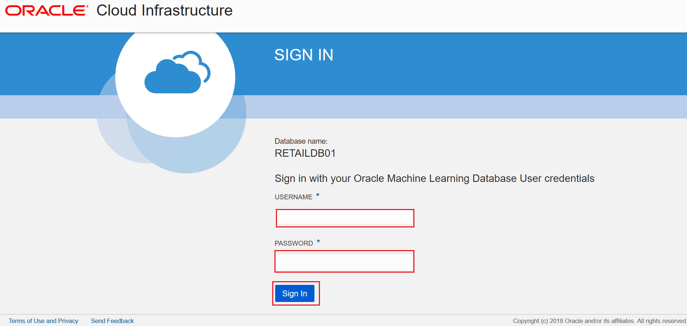

# Oracle Machine Learning with Autonomous Datawarehouse Cloud-Retail Workshop
 

   
   

April 4, 2019

Version 1.0

- Arindam Ghosh
( Solution Engineer)
arindam.ghosh@oracle.com
- Fabian Reginold
( Solution Engineer)
fabian.reginold@oracle.com

## Introduction

### Before you begin
#### Purpose
The purpose of this document is to systematically analyze the data present in autonomous data warehouse cloud and run the in-database machine learning algorithms in autonomous data warehouse Cloud.

Time to Complete
Approximately 30 minutes.

Topics covered in this document

**1. Getting Started with Oracle Machine Learning**

**2. Data Analysis in ADWC**

**3. Machine Learning Capabilities of ADWC**

## Getting Started with Oracle Machine Learning

#### Background

Oracle Machine Learning provides a notebook style application designed for advanced SQL users and provides interactive data analysis that lets you develop, document, share, and automate reports based on sophisticated analytics and data models. 

#### What Do You Need?
Before starting this instruction, you should:
-	Have already procured and activated a trial or paid subscription to the following cloud services.
-	Have already provisioned autonomous datawarehouse cloud.
- Access to your Oracle Machine Learning account.

## Data Analysis in ADWC
1. Log in to your Oracle Machine Learning account.

   Click on Notebooks in the home page.
   

2. In the Notebooks page, click on Create.

   Create Notebook dialog opens up. Provide the name of the notebook as RetailDemo(Analysis). The notebook opens in the Notebook editor.

3. In order to find the top 5 products being sold, enter the following sql statement in the first paragraph -

   SELECT COUNT(PRODUCTS) AS PRODUCT_COUNT,PRODUCTS FROM l_marketbasket GROUP BY PRODUCTS ORDER BY COUNT(PRODUCTS) DESC FETCH NEXT 5 ROWS ONLY 

   Click run icon in the first paragraph as shown in the screenshot.
   

   After the statement runs successfully, Oracle Machine Learning fetches the relevant data from the database and displays it in a tabular format. 
   In order to visualize the data in graphical output, click the bar icon for bar graphical representation.
   Click on settings and drag and drop the fields as shown in the screen-shot in the respective field boxes.

   The output visualization graph will be obtained as shown in the screenshot below.

4. In order to find the sales trend by day, enter the following sql statement in the second paragraph-

    SELECT count(products),order_hour_of_day,order_dow,order_now from l_marketbasket group by order_dow,order_now,order_hour_of_day order by order_dow; 

    Click run icon in the first paragraph as shown in the screenshot.

   After the statement runs successfully, Oracle Machine Learning fetches the relevant data from the database and displays it in a tabular format. 
   In order to visualize the data in graphical output, click the bar icon for bar graphical representation.
   Click on settings and drag and drop the fields as shown in the screen-shot in the respective field boxes.
   

   The output visualization graph will be obtained as shown in the screenshot below.
   

5. In order to find the order trend by day, enter the following sql statement in the second paragraph-

   SELECT count(order_id),order_hour_of_day from l_marketbasket group by order_hour_of_day ;
   Click run icon in the first paragraph as shown in the screenshot.

   After the statement runs successfully, Oracle Machine Learning fetches the relevant data from the database and displays it in a tabular format. 
   In order to visualize the data in graphical output, click the scatter-chart icon for bar graphical representation as shown in the screenshot.
   Click on settings and drag and drop the fields as shown in the screen-shot in the respective field boxes.
   

   The output visualization graph will be obtained as shown in the screenshot below.
   

6. In order to find the sales trend for each product in each day, enter the following sql statement in the second paragraph-

   SELECT count(order_id),order_hour_of_day from l_marketbasket group by order_hour_of_day ;
   Click run icon in the first paragraph as shown in the screenshot.

   After the statement runs successfully, Oracle Machine Learning       fetches the relevant data from the database and displays it in a tabular format. 
   In order to visualize the data in graphical output, click the area-chart icon for bar graphical representation as shown in the screenshot.
   Click on settings and drag and drop the fields as shown in the screen-shot in the respective field boxes.
   

   The output visualization graph will be obtained as shown in the screenshot below.
   

